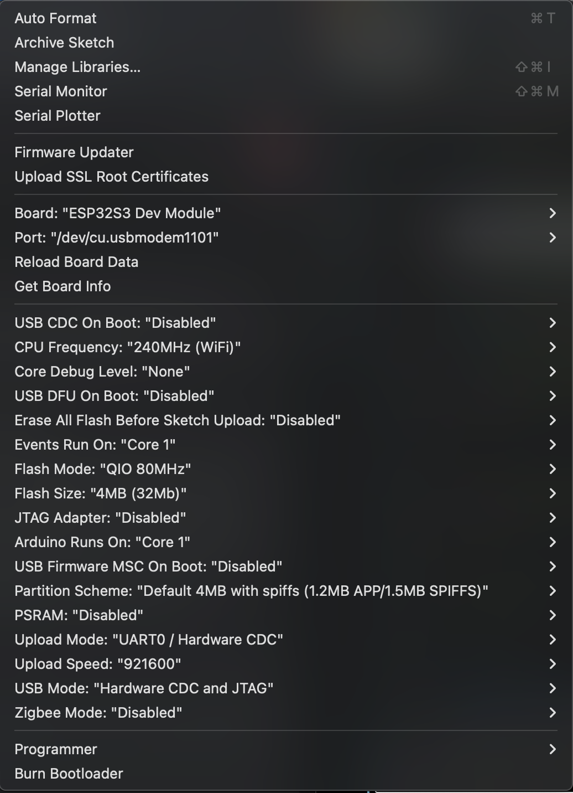

# 🍄 Mushroom Growth Hydroponics System (V1.00)
**An Automated Environmental Controller for Mycology**

This project is a environmental control system designed to regulate $CO_2$, humidity, and soil moisture for mushroom cultivation. Built on the **ESP32-S3**, it leverages JTAG debugging, real-time sensor validation, and non-blocking control logic to ensure a stable microclimate for high-yield growth.


## 🛠 Currently Implemented & Working
* **Dual-Core JTAG Debugging**: Established a stable debugging environment using **OpenOCD** and **xtensa-esp-elf-gdb** to troubleshoot fatal signals and memory segmentation faults.
* **Intelligent Gas Sensing**: Integrated the **ScioSense ENS160** using the I2C bus.
    * Implemented logic to monitor the `DEVICE_STATUS` register ($0\times20$).
    * System recognizes and handles **Initial Start-up (Validity Flag 2)** and **Warm-up (Validity Flag 1)** phases to prevent acting on unstable data.
* **Capacitive Soil Sensing**: Developed a calibration-based analog reading system.
    * Mapped raw 12-bit ADC values to moisture percentages using empirical data ($Dry \approx 3500$, $Wet \approx 1600$).
* **Multi-State OLED Interface**: Created a non-blocking UI that cycles through system states (CO2, Temp, Humidity, Moisture) every 10 seconds without stopping the main control loop.
* **I2C Bus Management**: Integrated an I2C scanner to verify hardware connectivity during boot.

## 💻 Development Environment & Build Settings
The project is developed using the **Arduino IDE** targeting the **ESP32-S3 Dev Module**.



| Setting | Value |
| :--- | :--- |
| **Board** | ESP32S3 Dev Module |
| **USB CDC On Boot** | Enabled |
| **CPU Frequency** | 240MHz (WiFi) |
| **Flash Mode / Size** | QIO 80MHz / 4MB (32Mb) |
| **USB Mode** | Hardware CDC and JTAG |
| **Upload Mode** | UART0 / Hardware CDC |

## 🛠 Build & Debugging Guide

### 1. Toolchain Setup
* **Compiler**: `Arduino IDE ESP-ELF Toolchain`
* **Debugger**: `xtensa-esp-elf-gdb` (v11.2)
* **JTAG Interface**: OpenOCD (Open On-Chip Debugger)

### 2. Hardware Debugging Workflow 🐛
This project utilizes the ESP32-S3's built-in USB-JTAG peripheral. To troubleshoot fatal crashes:

1.  **Launch OpenOCD** (Server):
    ```bash
    openocd -c "set ESP_RTOS none" -f board/esp32s3-builtin.cfg
    ```
2.  **Launch GDB** (Client):
    ```bash
    xtensa-esp-elf-gdb Mushroom_Growth_Project_V0.50.ino.elf
    ```
3.  **Establish Handshake**:
    * `target remote :3333` — Connect to hardware.
    * `monitor reset halt` — Pause CPU at start.
    * `break loop` — Set breakpoint at main logic.

### 3. Critical Register Monitoring 🔍
System reliability is verified by inspecting hardware registers directly in GDB:
* **ENS160 Status**: Inspect `DEVICE_STATUS` ($0\times20$).
* **Validity Flag Analysis**: If flag is `2` (0b10), the sensor is in **Initial Start-up** (1-hour burn-in); control logic is inhibited.

## 🚀 Future Roadmap
* ✅ **MVP Relay Matrix**: Implement **Hysteresis** triggers for Fan/Mister.
* 🏗 **Environmental Hardening**: Move to permanent soldered board with moisture protection.
* 🧪 **CI/CD Integration**: Automate logic verification using GitHub Actions and Unity.
* 🔋 **Power Management**: Transition to LiPo power with light-sleep optimization.
